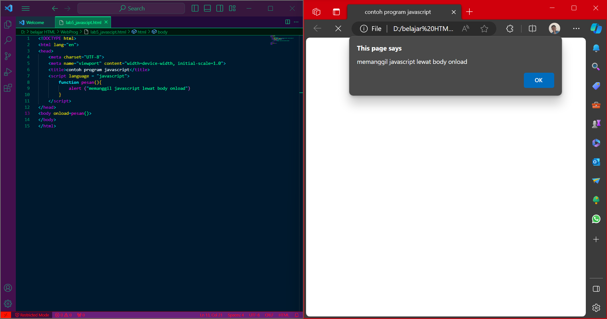

# Lab5_JavaScript 
|**Nama**|**NIM**|**Kelas**|**Matkul**|
|----|---|-----|------|
|Muhammad Fiqri Setyoadi|312210062|TI.22.A.2|Pemograman Web|

### JavaScript Dasar
- Pemakaian Alert sebagai property window

- Pemakaian Method dalam objek

- Pemakaian Prompt

- Pembuatan fungsi dan cara pemanggilannya

### Dasar Pemograman Di JavaScript
- Operasi Aritmatika

    setelahnya
    
- Seleksi Kondisi (if..else)

    setelahnya
    
- Penggunaan switch untuk seleksi kondisi

    setelahnya
    

### Pembuatan Form
- Form Input

- Form Button

    jika memilih warna latar belakang hijau maka akan seperti ini
    
    jika memilih teks kuning maka akan seperti ini
    
    jika memilih teks biru maka akan seperti ini
    

### HTNL DOM
- Pilihan menggunakan ``checkbox`` dengan perhitungan otomatis

### Pertanyaan dan Tugas
- Buat script untuk melakukan validasi pada isian form
untuk melihat code [HTML](Validalasi_Isian_Form.html)
    ini yang akan terjadi jika tidak mengisi nama
    
    ini yang akan terjadi juga jika mengisi alamat email tidak benar
    
    untuk yang valid maka isi seperti berikut
    

### Sekian dan Terimakasih, Mohon maaf bila ada kesalahan, Salam hangat dari saya 🙏 🎓 😍